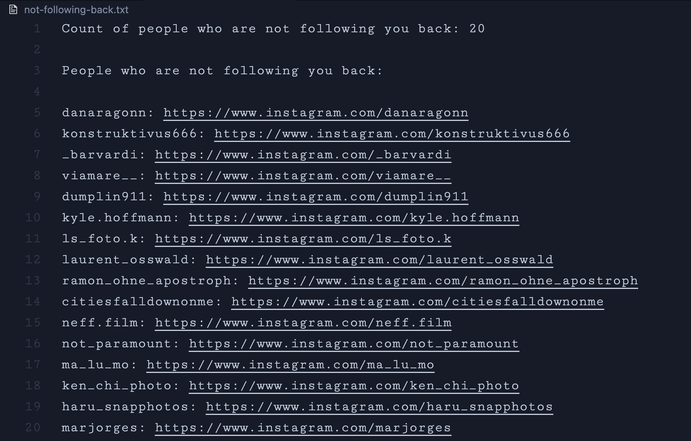

# Instagram Follow-Back Checker

This Python script helps you identify who you are following on Instagram but who are not following you back. The script outputs a list of such users along with their profile URLs to a text file for easy unfollowing.

## Features

- Load followers and following data from JSON files.
- Compare the lists to find users who are not following you back.
- Output the result to a downloadable text file with usernames and profile URLs.

## How to Use

### Prerequisites

- Python 3.x

### Steps

1. **Obtain Your Followers and Following Data:**

    - Go to Instagram and log in to your account.
    - Navigate to your profile and click on the settings icon.
    - Go to "Meta Account Center".
    - Under "Your Information and Permissions", click on "Download Your Information".
    - Select your account.
    - Select the data you want to download, making sure to check **Followers** and **Following**.
    - Choose the format as **JSON**.
    - Submit your request. Instagram will send you an email with a link to download your data.
    - After some time, you will receive an email from Instagram with the download link.
    - Download the data and extract the ZIP file.
    - Inside the extracted folder, you will find `followers.json` or `followers1.json` and `following.json` files in the appropriate subfolders.

2. **Clone the Repository:**

    ```bash
    git clone https://github.com/wsjishan/instagram-follow-back-checker.git
    cd instagram-follow-back-checker
    ```

3. **Add Your Data:**

    - Place your `followers.json` and `following.json` files in the same directory as the script.

4. **Run the Script:**

    ```bash
    python check_follow_back.py
    ```

5. **Check the Output:**

    - The script will generate a file named `not_following_back.txt` containing the list of users who are not following you back along with their profile URLs.

## Example Output

